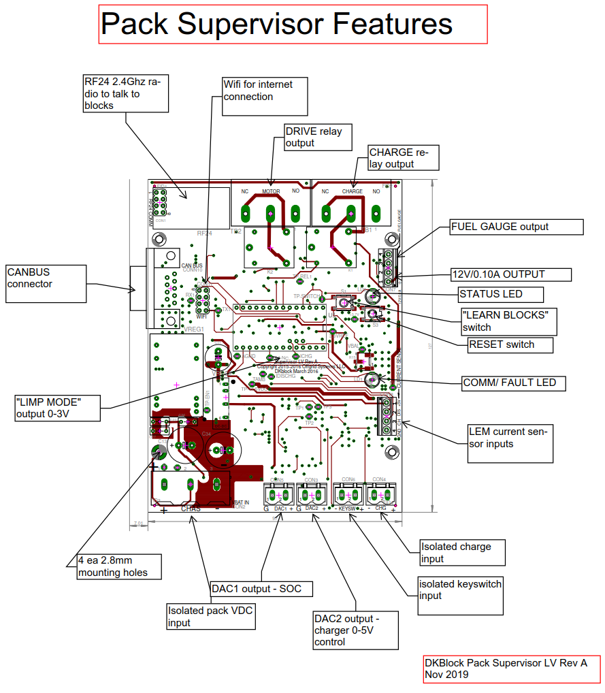

# Pack Supervisor
### Hardware Files For The 127x97mm Pack Supervisor Board
These are the printed circuit board (PCB) files, CAD files, specification sheets and all technical drawings needed to make the DKblock Pack Supervisor board. Note that the bill of materials (BOM) and other technical documents can be opened in [OpenOffice](https://www.openoffice.org) format and PCB files are in [EAGLE](https://www.autodesk.com/products/eagle/overview) format but they can also be opened and edited in the open source Kicad program.

#### Two Versions Are Provided Rev A and Rev B
- Rev A - Revision A (retired name of board is Supervisor LV Rev A)  is a fully tested board, put into  production on a 72VDC electric scooter named Fido, and a 150VDC VW bug conversion.
- Rev B - Revision B are design files that make improvements on the A version, and change the board name to Pack Supervisor 97x127mm Rev B, but *Rev B has neither not been built nor tested in the real world*. Note that most of the changes are minor and are simple tweaks to improve performance or reliability.

New V2 radio (replaces RF24 board and requires new Supervisor V2 firmware)

All DKblock software and hardware is released as open source hardware (OSHW) as defined by the OSHWA: https://www.oshwa.org/definition/ and under the JSON license defined at https://www.json.org/license.html
 
